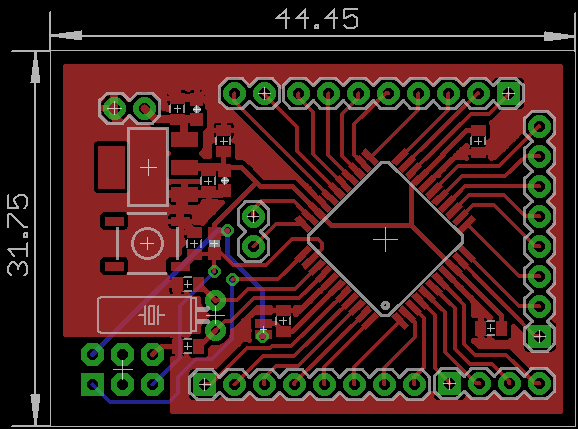

# xmega32d4-devboard
This is just another Atmel ATxmega32D4 development board with onboard 3.3V LDO and 32.768 kHz xtal. For further information, please read the [Atmel ATxmega32D4 datasheet](http://www.atmel.com/images/Atmel-8135-8-and-16-bit-AVR-microcontroller-ATxmega16D4-32D4-64D4-128D4_datasheet.pdf).

